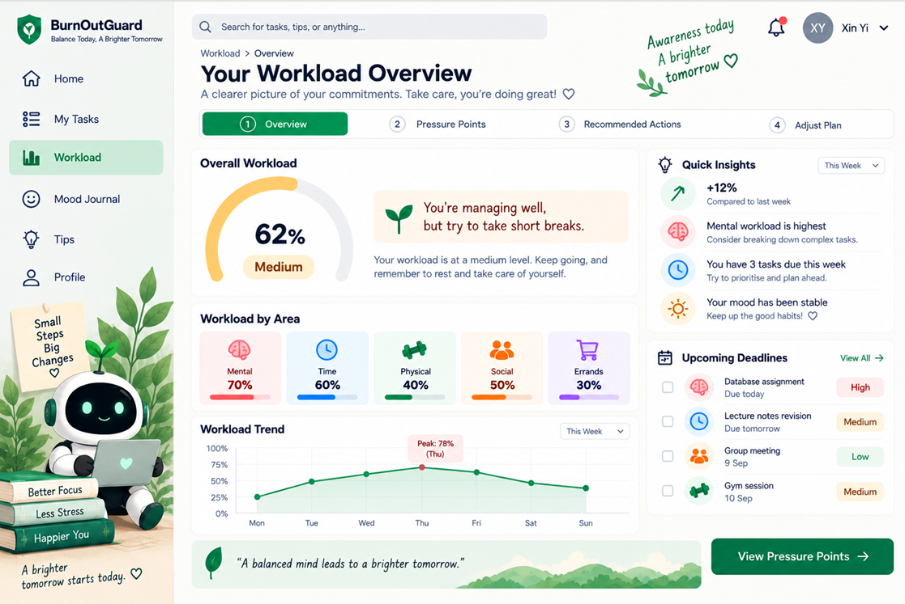
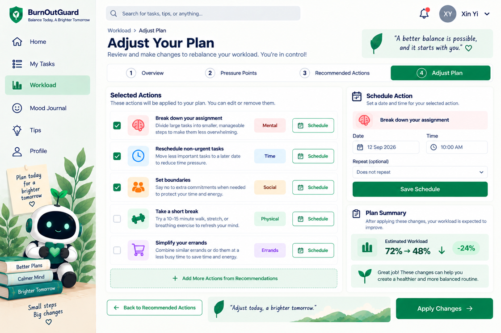
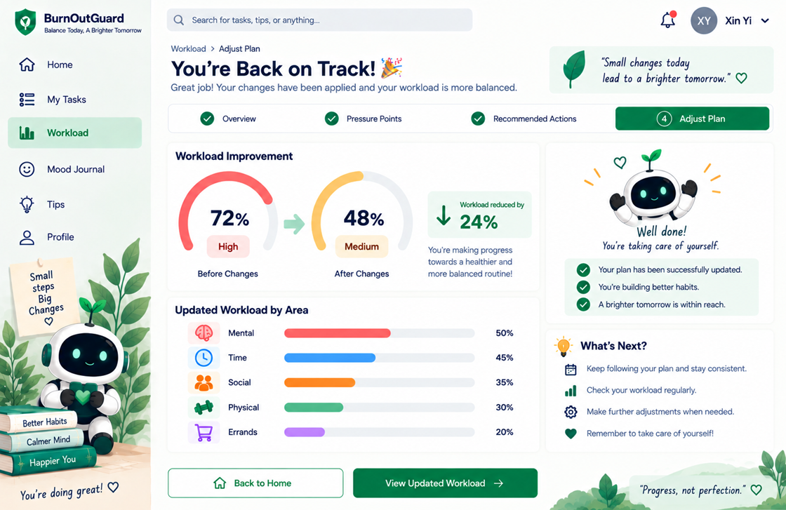

# BurnOutGuard by FourBit

**Team:** Tan Jia Wen, Toh Xin Yi, Lim Pei Qin, Lee Sin Yee  
**Problem Statement:** Stress & Workload Manager  
**Video Presentation:** [Unlisted YouTube Link - To be added]  
**Presentation Slides:** [Public Link - To be added]

---

## 1. Project Overview

### The Problem

University students often juggle multiple responsibilities at the same time, including assignments, examinations, classes, deadlines, meetings, part-time jobs, social commitments, physical needs, and daily errands. These responsibilities can build up across different areas of student life without students clearly noticing how much they are carrying.

We identified five main workload areas:

- **Mental** - assignments, exams, academic pressure, and stress
- **Time** - classes, deadlines, meetings, and other commitments
- **Physical** - sleep, exercise, fatigue, and travelling
- **Social** - friends, family, social activities, and group events
- **Errands** - shopping, appointments, banking, and daily chores

The core problem is that students may not realise how these different responsibilities combine to create an overloaded workload. This can lead to stress, fatigue, feeling overwhelmed, reduced productivity, and a greater risk of burnout.

### Stakeholders

Our **primary stakeholders are university students**, especially students managing several academic and non-academic responsibilities at the same time. They are the direct users of the system and need a simple way to understand where their workload is coming from and what they can realistically adjust.

**Secondary stakeholders** may include lecturers, academic advisors, student-support staff, and universities. They are not the main users of the BurnOutGuard, but they may benefit indirectly when students are better able to recognise overload and manage their responsibilities before reaching burnout.

### Similar Solutions and Their Limitations

> **Note:** Todoist and Sunsama are existing market solutions used only for competitor/similar-solution comparison. They are **not** ideas generated by FourBit and are therefore not part of Section 2: Ideation & Process.

**Todoist** is a general to-do list and task-management tool. It helps users capture and organise tasks, focus on Today or Upcoming work, schedule due dates, use a calendar view, and create recurring tasks. However, its main focus is task organisation and planning rather than analysing a student's combined workload across Mental, Time, Physical, Social, and Errands.

**Sunsama** is a daily planning and workload-management tool. It combines tasks and calendar events, lets users estimate planned time, compares planned work against a configurable workload threshold, warns users when they are overcommitted, and allows work to be deferred. This makes it closer to our concept than a standard to-do list. However, its workload calculation is primarily based on planned work time, and its workload threshold excludes tasks in personal contexts. It does not provide the same five-area student-life workload model proposed by Workload Rebalancer.

These limitations create an opportunity for **BurnOutGuard** to focus specifically on university students and consider workload across **Mental, Time, Physical, Social, and Errands**, then connect identified pressure points with rebalancing and recovery.

### Our Solution

**BurnOutGuard** is a student-focused system that gives students a clearer picture of their overall workload across five areas: Mental, Time, Physical, Social, and Errands. It helps students recognise when their workload is becoming too high, understand which areas are contributing most to the pressure, and consider practical ways to rebalance their responsibilities. Rather than simply tracking and reporting workload, the concept is designed around the journey from **understanding overload to taking action and making space for recovery**.

### Proposed Core Features

The exact interactions will be refined during UI prototyping and the building phase. Our current proposed feature set is:

- Input responsibilities across the five workload areas
- Visualise overall workload and workload by area
- Detect possible overload
- Identify major pressure points
- Provide practical rebalancing suggestions
- Support workload adjustment and recovery

---

## 2. Ideation & Process

### 2.1 Ideas We Considered

Our team explored several approaches before selecting BurnOutGuard. We compared each idea based on how well it addressed the student's overall workload rather than only one part of the problem.

| Idea | Why It Was Kept / Dropped |
|---|---|
| **BurnOutGuard (Chosen)** | Addresses overload and helps students rebalance their workload instead of only showing or tracking the problem. |
| **Workload Dashboard (Improved)** | Shows workload across different areas, but may only show the problem without helping students decide what to do. Its visualisation concept contributed to the final idea. |
| **Recovery Planner (Improved)** | Encourages students to make time for recovery, but does not address the causes of workload overload by itself. Recovery therefore became part of the final direction. |
| Stress Tracker | Dropped because it only monitors stress and does not address the different sources of student workload. |
| Mood Tracker | Dropped because it focuses on students' emotions rather than managing their overall workload. |
| Student To-Do List | Dropped because it mainly helps students organise tasks and deadlines and does not consider the five workload areas together. |
| Smart Calendar | Dropped because it mainly focuses on scheduling and may not address the other workload areas. |
| Study Planner | Dropped because it mainly focuses on academic workload rather than the student's overall workload. |

### 2.2 Ideation Boards

Our ideation process moved from understanding the causes of student overload to exploring possible solutions and developing a system that can help students rebalance their responsibilities.

#### Problem Tree

The problem tree shows how causes such as too many responsibilities, clashing deadlines, difficulty prioritising, and limited recovery time contribute to overloaded student workload and effects such as stress, fatigue, feeling overwhelmed, reduced productivity, and risk of burnout.

#### Mindmap

The mindmap explores the five workload areas - Mental, Time, Physical, Social, and Errands - together with the key problems students face and what students need from a workload management solution.

#### Idea Evolution

Our idea evolved through three main iterations:

**Stress Tracker -> Workload Dashboard -> BurnOutGuard**

The Stress Tracker was too narrow because it focused only on stress. The Workload Dashboard improved the idea by showing workload across five areas, but it mainly showed the problem without helping students decide what to do. The final BurnOutGuard goes beyond tracking by helping students identify overload and take action on their overall workload.

#### User Flow

The current ideation flow is:

**Input Workload -> Analyse Workload -> Detect Overload -> Identify Pressure Points -> Recommend Actions -> Rebalance Workload -> Recovery**

This is the original flow developed during ideation. The detailed interactions within each step will be refined during UI prototyping without changing the core journey.

### 2.3 Mentor Consultation

| Date | Mentor | Feedback Received | What Was Changed |
|---|---|---|---|
| [To be added] | [To be added] | [To be added after mentor consultation] | [To be added after mentor consultation] |

---

## 3. Design & Prototype

**UI Prototype:** [BurnOutGuard UI Prototype](./UI.pdf)

The BurnOutGuard prototype follows our original ideation flow:

**Input Workload -> Analyse Workload -> Detect Overload -> Identify Pressure Points -> Recommend Actions -> Rebalance Workload -> Recovery**

### Key Screens

#### 1. Home Dashboard

Students can view their current overall workload, workload across the five areas, upcoming tasks, and quick actions from the dashboard.

#### 2. My Tasks

Students can add and organise tasks by selecting a workload area, due date, and priority. This provides the workload information used by BurnOutGuard.

#### 3. Workload Overview

Students can view their overall workload, workload by area, workload trends, and upcoming deadlines to understand their current workload.

#### 4. Pressure Points

Students can identify which workload areas are contributing most to their current pressure and understand the factors affecting each area.

#### 5. Recommended Actions

BurnOutGuard provides personalised actions based on the identified pressure points, such as rescheduling tasks, setting boundaries, taking a short break, or simplifying errands.

#### 6. Adjust Your Plan

Students can select recommended actions, schedule changes, and review the expected workload improvement before applying the changes.

#### 7. You're Back on Track

Students can compare their workload before and after applying the changes and see how their workload has been reduced to a more manageable level.

## 4. What Makes It Different

The goal of BurnOutGuard is not to become another general to-do list or calendar. Its proposed differentiation comes from combining several ideas around the specific problem of **student workload overload**.

### 1. Integrated Five-Area Workload Model

The system considers **Mental, Time, Physical, Social, and Errands** together. This allows students to see how responsibilities from different parts of their lives can contribute to their overall workload rather than focusing only on academic tasks.

### 2. From Workload Visibility to Pressure-Point Identification

A normal dashboard can show that workload is high. BurnOutGuard aims to go one step further by helping the student understand **which workload areas are contributing most to the overload**.

### 3. From Tracking to Rebalancing

The main twist of the concept is the transition from simply reporting workload to helping the student consider **what can be changed**. Recommendations connect identified pressure points with practical rebalancing actions, such as rescheduling tasks, setting boundaries, taking short breaks, or simplifying errands.

### 4. Recovery Is Part of the Workload Journey

Recovery is not treated as a separate mood or wellness tracker. It is connected to the rebalancing process so that reducing overload can create more realistic space for rest and recovery.

### Novel Aspect of the Proposed Concept

The originality of BurnOutGuard comes from the **combination** of its five-area workload model, pressure-point identification, rebalancing support, and recovery-oriented outcome. These elements are designed to work as one continuous journey:

**Understand Workload -> Identify Pressure Points -> Take Action -> Rebalance -> Recover**

> These are proposed differentiators. After implementation, this section will be updated so that it describes only features that were actually built.

---

## 5. Technical Architecture & Feasibility

### Tech Stack

The team has **not finalised the technical stack yet**. This section will only be completed after the technologies have been selected for the actual build.

| Component | Selected Technology | Why We Chose It / Constraints |
|---|---|---|
| Frontend | To be confirmed | To be completed after team decision |
| Backend | To be confirmed | To be completed after team decision |
| Database | To be confirmed | To be completed after team decision |
| APIs / Services | To be confirmed | To be completed after team decision |
| Hosting | To be confirmed | Must support a deployable demonstration of the system |

### System Architecture Diagram

To be added after the technical stack and system structure are confirmed.

### Build Plan & Scope

Our build scope will follow the core concept established during ideation. During the building phase, we plan to create a usable prototype that demonstrates the following core journey:

1. Students enter responsibilities across relevant workload areas.
2. The system analyses the student's overall workload.
3. The system identifies possible overload.
4. The system highlights the main pressure points.
5. The system presents possible actions.
6. The student can use those actions to rebalance their workload.
7. The resulting plan creates greater space for recovery.

The exact workload calculation method, recommendation logic, UI interactions, technical architecture, and optional features will be finalised during the prototype and building phases. This keeps the scope realistic while preserving the central idea of **understand -> identify -> rebalance -> recover**.
