# BurnOutGuard by FourBit

**Team:** Tan Jia Wen, Toh Xin Yi, Lim Pei Qin, Lee Sin Yee  
**Problem Statement:** Stress & Workload Manager  
**Video Presentation:** [Unlisted YouTube Link - To be added]  
**Presentation Slides:** [Public Link - To be added]

---

## 1. Project Overview

### The Problem

University students often juggle multiple responsibilities at the same time, including assignments, examinations, classes, deadlines, meetings, part-time jobs, social commitments, physical needs, and daily errands. These responsibilities can build up across different areas of student life without students clearly noticing how much they are carrying.

We identified five main workload areas:

- **Mental** - assignments, exams, academic pressure, and stress
- **Time** - classes, deadlines, meetings, and other commitments
- **Physical** - sleep, exercise, fatigue, and travelling
- **Social** - friends, family, social activities, and group events
- **Errands** - shopping, appointments, banking, and daily chores

The core problem is that students may not realise how these different responsibilities combine to create an overloaded workload. This can lead to stress, fatigue, feeling overwhelmed, reduced productivity, and a greater risk of burnout.

### Stakeholders

Our **primary stakeholders are university students**, especially students managing several academic and non-academic responsibilities at the same time. They are the direct users of the system and need a simple way to understand where their workload is coming from and what they can realistically adjust.

**Secondary stakeholders** may include lecturers, academic advisors, student-support staff, and universities. They are not the main users of the BurnOutGuard, but they may benefit indirectly when students are better able to recognise overload and manage their responsibilities before reaching burnout.

### Similar Solutions and Their Limitations

> **Note:** Todoist and Sunsama are existing market solutions used only for competitor/similar-solution comparison. They are **not** ideas generated by FourBit and are therefore not part of Section 2: Ideation & Process.

**Todoist** is a general to-do list and task-management tool. It helps users capture and organise tasks, focus on Today or Upcoming work, schedule due dates, use a calendar view, and create recurring tasks. However, its main focus is task organisation and planning rather than analysing a student's combined workload across Mental, Time, Physical, Social, and Errands.

**Sunsama** is a daily planning and workload-management tool. It combines tasks and calendar events, lets users estimate planned time, compares planned work against a configurable workload threshold, warns users when they are overcommitted, and allows work to be deferred. This makes it closer to our concept than a standard to-do list. However, its workload calculation is primarily based on planned work time, and its workload threshold excludes tasks in personal contexts. It does not provide the same five-area student-life workload model proposed by Workload Rebalancer.

These limitations create an opportunity for **BurnOutGuard** to focus specifically on university students and consider workload across **Mental, Time, Physical, Social, and Errands**, then connect identified pressure points with rebalancing and recovery.

### Our Solution

**BurnOutGuard** is a student-focused system that gives students a clearer picture of their overall workload across five areas: Mental, Time, Physical, Social, and Errands. It helps students recognise when their workload is becoming too high, understand which areas are contributing most to the pressure, and consider practical ways to rebalance their responsibilities. Rather than simply tracking and reporting workload, the concept is designed around the journey from **understanding overload to taking action and making space for recovery**.

### Proposed Core Features

The exact interactions will be refined during UI prototyping and the building phase. Our current proposed feature set is:

- Input responsibilities across the five workload areas
- Visualise overall workload and workload by area
- Detect possible overload
- Identify major pressure points
- Provide practical rebalancing suggestions
- Support workload adjustment and recovery

---

## 2. Ideation & Process

### 2.1 Ideas We Considered

Our team explored several approaches before selecting BurnOutGuard. We compared each idea based on how well it addressed the student's overall workload rather than only one part of the problem.

| Idea | Why It Was Kept / Dropped |
|---|---|
| **BurnOutGuard (Chosen)** | Addresses overload and helps students rebalance their workload instead of only showing or tracking the problem. |
| **Workload Dashboard (Improved)** | Shows workload across different areas, but may only show the problem without helping students decide what to do. Its visualisation concept contributed to the final idea. |
| **Recovery Planner (Improved)** | Encourages students to make time for recovery, but does not address the causes of workload overload by itself. Recovery therefore became part of the final direction. |
| Stress Tracker | Dropped because it only monitors stress and does not address the different sources of student workload. |
| Mood Tracker | Dropped because it focuses on students' emotions rather than managing their overall workload. |
| Student To-Do List | Dropped because it mainly helps students organise tasks and deadlines and does not consider the five workload areas together. |
| Smart Calendar | Dropped because it mainly focuses on scheduling and may not address the other workload areas. |
| Study Planner | Dropped because it mainly focuses on academic workload rather than the student's overall workload. |

### 2.2 Ideation Boards

Our ideation process moved from understanding the causes of student overload to exploring possible solutions and developing a system that can help students rebalance their responsibilities.

#### Problem Tree

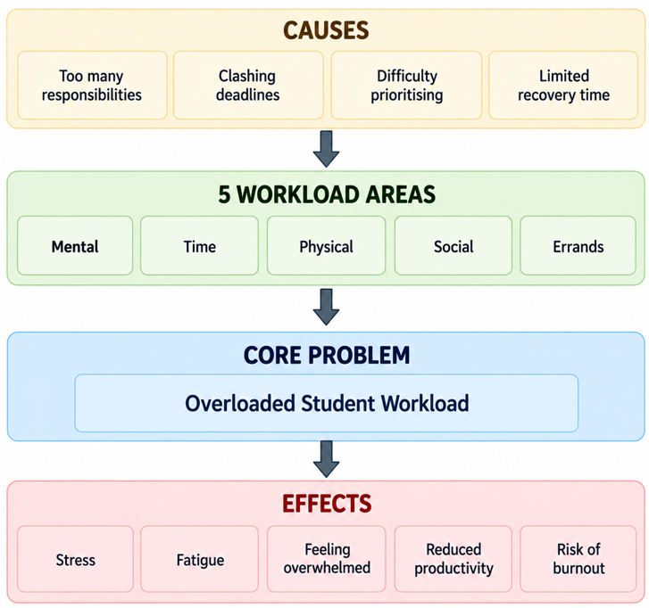

The problem tree shows how causes such as too many responsibilities, clashing deadlines, difficulty prioritising, and limited recovery time contribute to overloaded student workload and effects such as stress, fatigue, feeling overwhelmed, reduced productivity, and risk of burnout.

#### Mindmap

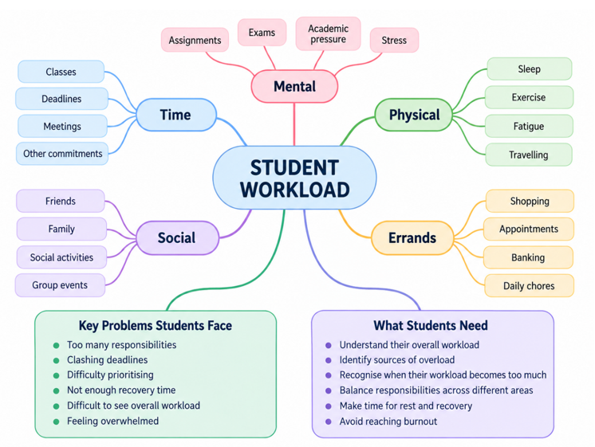

The mindmap explores the five workload areas - Mental, Time, Physical, Social, and Errands - together with the key problems students face and what students need from a workload management solution.

#### Idea Evolution

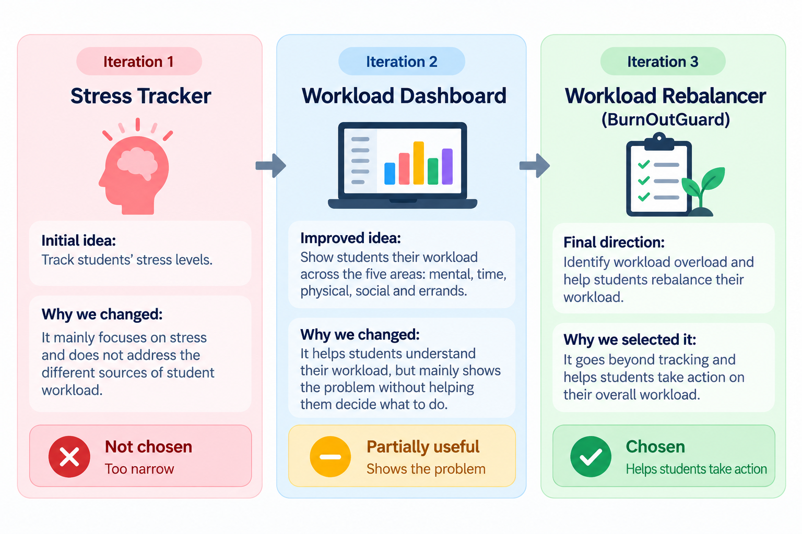

Our idea evolved through three main iterations:

**Stress Tracker -> Workload Dashboard -> BurnOutGuard**

The Stress Tracker was too narrow because it focused only on stress. The Workload Dashboard improved the idea by showing workload across five areas, but it mainly showed the problem without helping students decide what to do. The final BurnOutGuard goes beyond tracking by helping students identify overload and take action on their overall workload.

#### User Flow

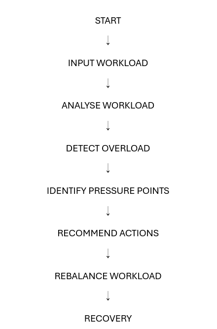

The current ideation flow is:

**Input Workload -> Analyse Workload -> Detect Overload -> Identify Pressure Points -> Recommend Actions -> Rebalance Workload -> Recovery**

This is the original flow developed during ideation. The detailed interactions within each step will be refined during UI prototyping without changing the core journey.

### 2.3 Mentor Consultation

| Date | Mentor | Feedback Received | What Was Changed |
|---|---|---|---|
| [To be added] | [To be added] | [To be added after mentor consultation] | [To be added after mentor consultation] |

---

## 3. Design & Prototype

### UI Prototype

[View the BurnOutGuard UI Prototype](UI.pdf)

The BurnOutGuard prototype translates our ideation journey into a student-focused workload management experience. The core interaction follows:

**Input Workload → Analyse → Identify Pressure Points → Recommend Actions → Adjust Plan → See Results → Recovery**

The prototype is designed around the idea that students should not only see that their workload is high, but should also understand what is contributing to the pressure and have practical ways to respond.

### Key Screens

#### 1. Home Dashboard

The Home Dashboard gives students an **at-a-glance view of their workload and well-being**. It highlights the **overall workload level**, workload distribution across the five areas — **Mental, Time, Physical, Social, and Errands** — as well as **upcoming tasks and today's mood**.

The **Quick Actions** provide direct access to adding tasks, viewing tasks, logging mood, and getting tips, while the workload analysis can be accessed directly from the dashboard.

**Key purpose:** Give students an immediate understanding of **how much they are carrying, where their workload is distributed, and what they can do next**.

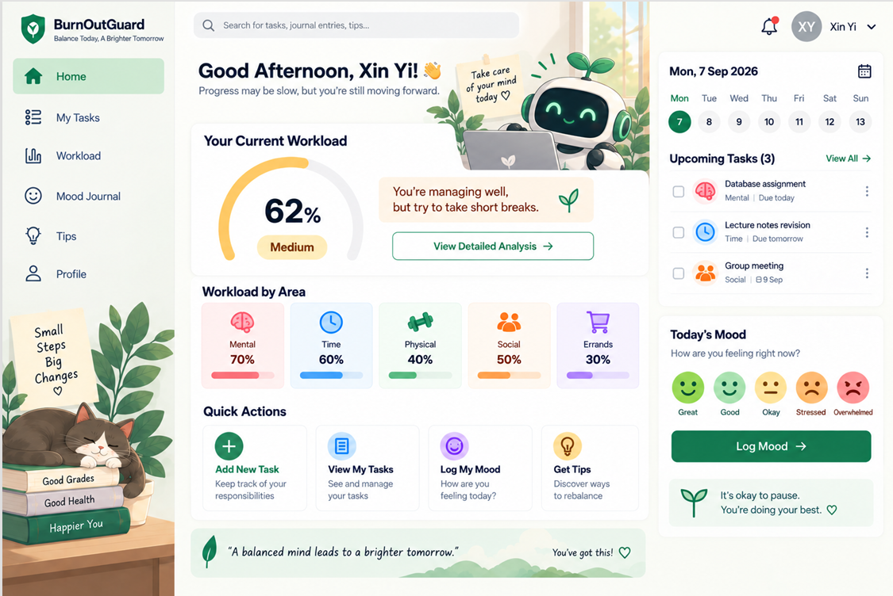

---

#### 2. My Tasks

My Tasks allows students to organise their responsibilities and connect each task to one of the five workload areas: **Mental, Time, Physical, Social, and Errands**. Each task displays its workload area and deadline, helping students see that everyday responsibilities contribute to their overall workload, not just academic tasks.

Students can also filter tasks by **All, Today, This Week, or This Month**, search for specific tasks, and quickly add new responsibilities.

**Key purpose:** Capture and organise the different responsibilities that contribute to a student's overall workload, providing the foundation for BurnOutGuard's workload analysis.

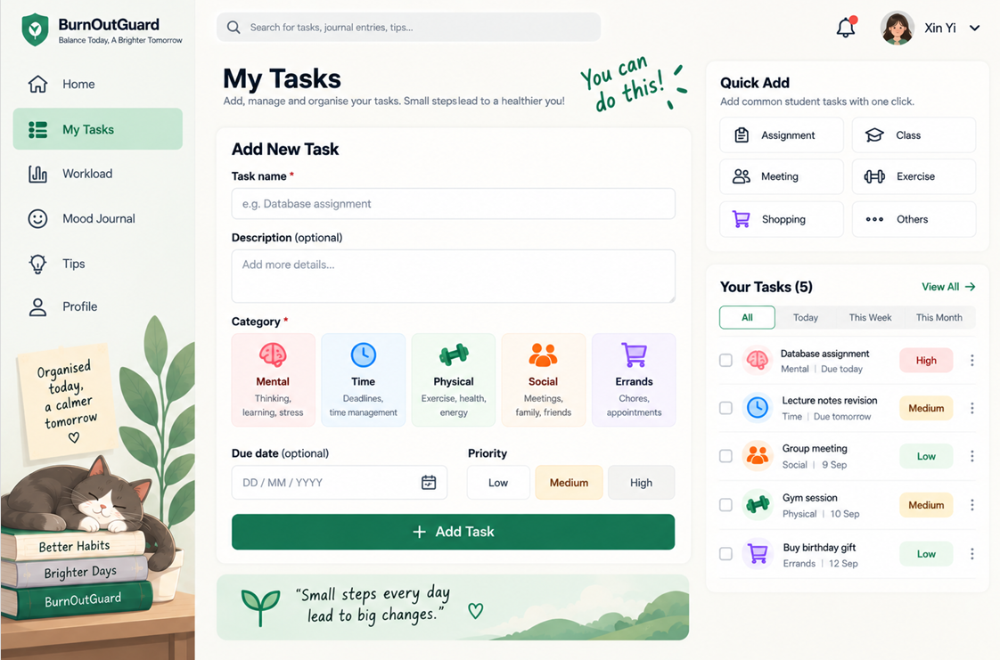

---

#### 3. Workload Overview

The Workload page transforms the student's tasks into an **overall workload picture**. It shows the **overall workload level**, compares it with the previous week, and breaks the workload down across the five areas: **Mental, Time, Physical, Social, and Errands**.

The **Weekly Workload Trend** helps students see how their workload changes over time. The Quick Actions also provide direct access to **Pressure Points, Recommended Actions, Adjust Your Plan, and Progress**, connecting workload analysis to the next steps of the BurnOutGuard journey.

**Key purpose:** Help students understand **how much they are carrying, where their workload is concentrated, and when they may need to take action.**

**Next step:** Students can select **View Pressure Points** to investigate what is contributing to their workload pressure.

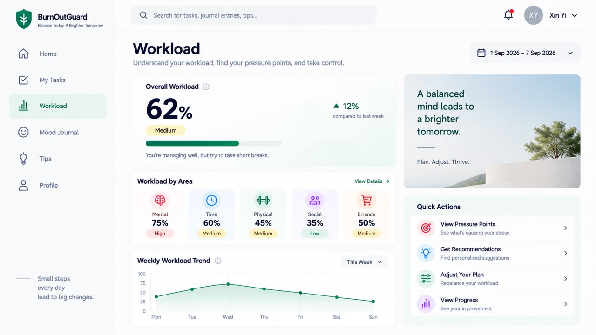

---

#### 4. Pressure Points

After selecting **View Pressure Points** from the Workload page, students are taken to Pressure Points. This page goes beyond simply showing a workload score by identifying **which workload areas are contributing most to the student's pressure**.

It provides further context through **common triggers, related tasks, and an explanation of why the workload is high**. For example, the prototype highlights Mental workload as the highest area and connects it with factors such as exams and deadlines, high expectations, and overthinking.

**Key purpose:** Help students understand **where their pressure comes from and what is contributing to it**, so they can make informed decisions about what to change next.

**Next step:** Students can move to **Recommended Actions** to see practical ways to respond to the identified pressure points.

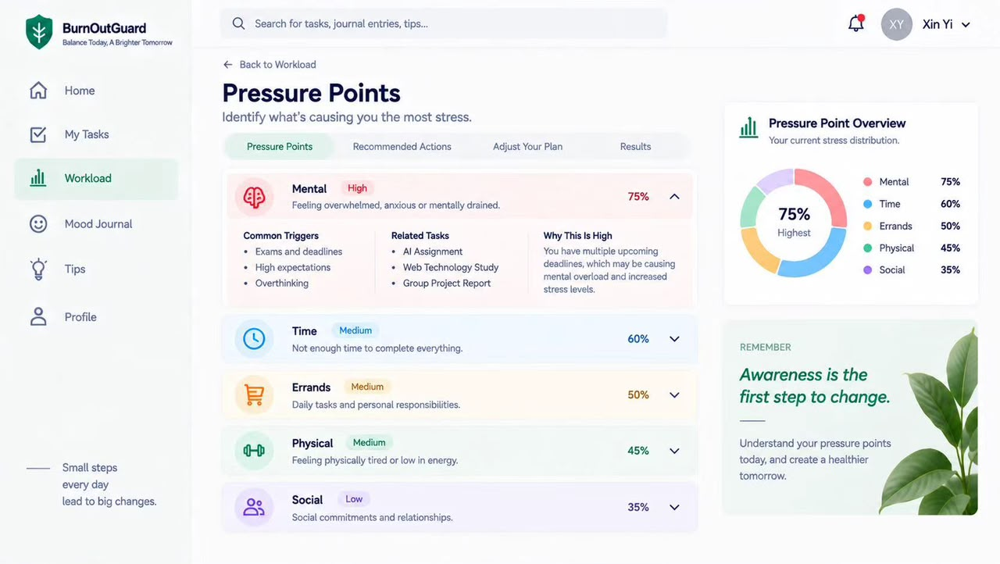

---

#### 5. Recommended Actions

After identifying the student's pressure points, BurnOutGuard provides **practical actions that students can consider to reduce or manage their workload**. Recommendations are linked to specific workload areas and include actions such as breaking a large assignment into smaller tasks, rescheduling a non-urgent task, and postponing a lower-priority errand.

Students can select suitable recommendations using **Add to Plan**, allowing them to carry the chosen actions into the next step of the workload-rebalancing process.

**Key purpose:** Turn workload awareness into **practical, actionable changes** that students can apply to their plan.

**Next step:** Selected recommendations can be reviewed and applied in **Adjust Your Plan**.

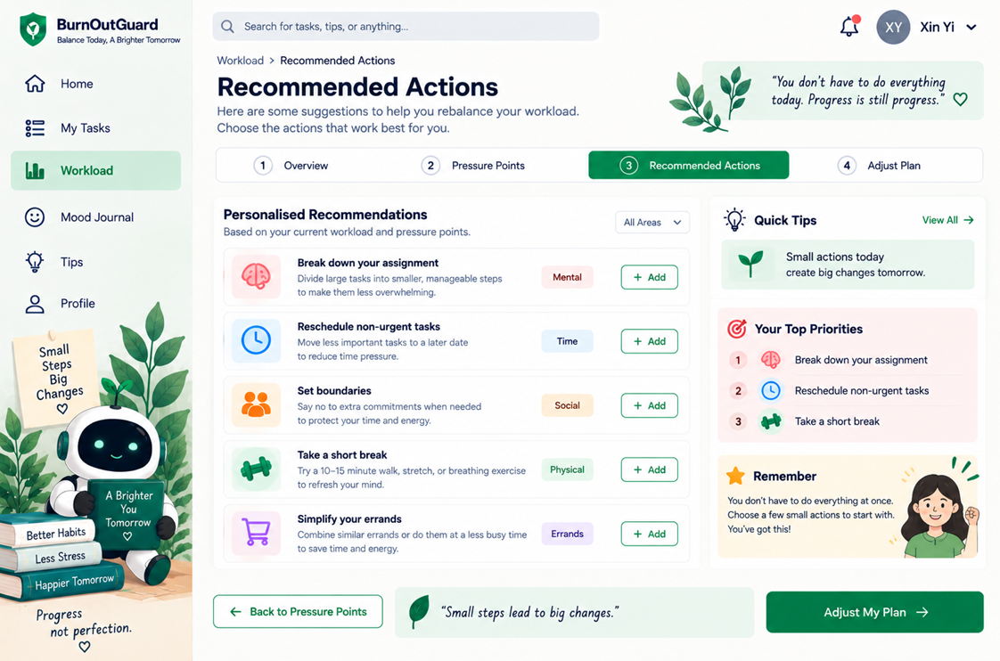

---

#### 6. Adjust Your Plan

After selecting suitable recommendations, students can use **Adjust Your Plan** to actively rebalance their workload. The screen allows students to review their schedule, apply selected recommendations, and include dedicated **recovery time** in their revised plan.

The **Plan Preview** summarises the adjusted schedule, including total tasks, focused study time, break time, and personal time. Students can then select **Apply Changes & View Results** to see the impact of their adjustments.

**Key purpose:** Help students turn recommendations into **real changes to their workload and schedule**, while creating space for recovery.

**Next step:** Students can apply their changes and view the **before-and-after results**.

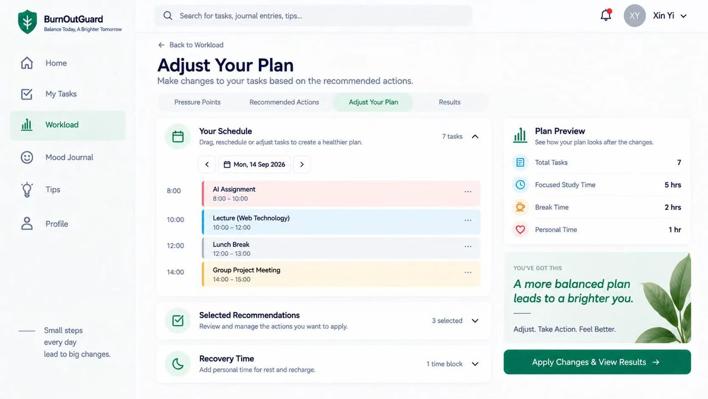

---

#### 7. Results

After students apply changes to their plan, the Results page shows **how their workload has changed before and after the adjustments**. It provides an overall comparison as well as a breakdown across the five workload areas.

The page also highlights **Pressure Points After Changes**, allowing students to see which areas have improved, while the detailed breakdown explains the changes made and how they contributed to the new workload.

**Key purpose:** Show students the **impact of their workload adjustments** and help them understand whether their workload has become more manageable.

**Next step:** Students can use the improved workload state as a basis for maintaining a more balanced plan and making space for recovery.

*The values shown in the prototype are illustrative examples demonstrating the intended interaction.*

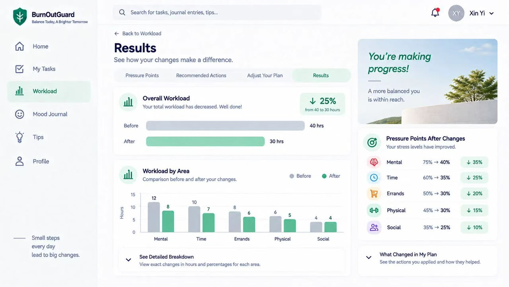

---

#### 8. Tips & BurnOutBuddy AI Chatbot

The **Tips for a Healthier You** page provides practical guidance across **Stress Management, Time Management, Study Tips, Mental Health, and Lifestyle**. The **Recommended for You** section presents relevant tips based on the student's recent mood and workload, while students can also explore additional well-being content by category.

The page also includes **BurnOutBuddy**, an AI chatbot that allows students to ask for quick tips and basic well-being guidance directly within the app.

**Key purpose:** Provide students with **accessible, practical support for managing stress, developing healthier habits, and making space for recovery**.

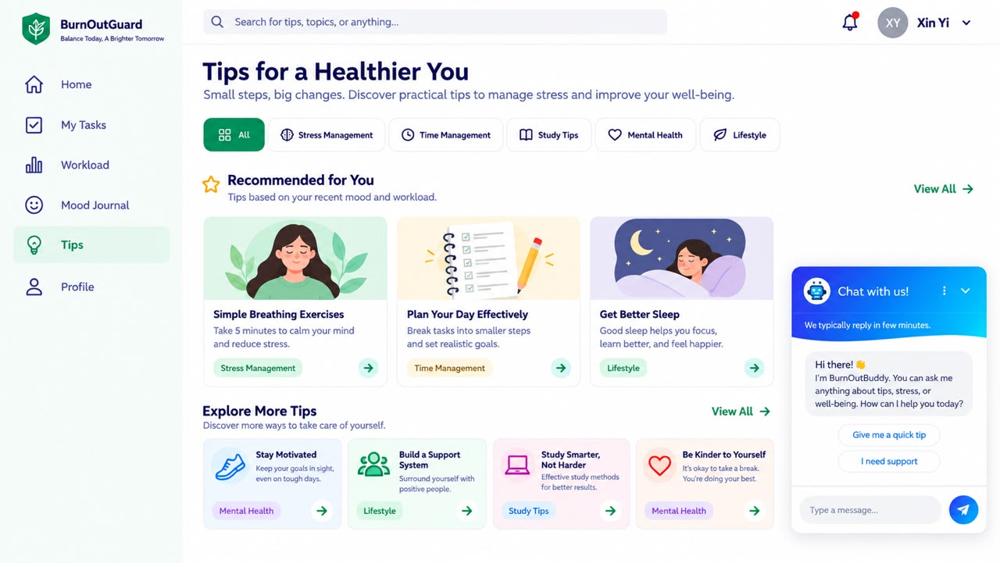

### Supporting Features

Beyond the core workload-rebalancing journey, BurnOutGuard includes supporting features that connect workload management with student well-being:

- **Mood Journal** – Record moods and reflections through text, voice recordings, images, and tags.
- **Mood Insights** – View mood patterns, trends, and key insights over time.
- **Tips for a Healthier You** – Explore practical guidance across Stress Management, Time Management, Study Tips, Mental Health, and Lifestyle, including recommendations based on recent mood and workload.
- **BurnOutBuddy AI Chatbot** – Provides quick tips and basic well-being guidance directly within the app.
- **Profile & Settings** – Manage personal information, notifications, theme, language, and privacy and security preferences.

These features complement the core workload journey by supporting **reflection, healthier habits, guidance, and recovery**.

### Core User Journey

**Add Workload → Analyse → Identify Pressure Points → Recommend Actions → Adjust Plan → See Results → Recovery**

- **Add Workload** – Record responsibilities across Mental, Time, Physical, Social, and Errands.
- **Analyse** – Understand overall workload and its distribution across the five areas.
- **Identify Pressure Points** – Discover which areas contribute most to workload pressure, including common triggers and related tasks.
- **Recommend Actions** – Receive practical actions to address identified pressure points.
- **Adjust Plan** – Select suitable actions, rebalance responsibilities, and include recovery time.
- **See Results** – Compare workload before and after adjustments and see changes across the five areas.
- **Recovery** – Create realistic space for rest and recovery as part of maintaining a balanced workload.

### Core Design Principle

> **BurnOutGuard does not just show students that they are overloaded. It helps them understand why, decide what to change, rebalance their responsibilities, and make space for recovery.**

**Understand → Identify → Act → Rebalance → Recover**

## 4. What Makes It Different

The goal of BurnOutGuard is not to become another general to-do list or calendar. Its proposed differentiation comes from combining several ideas around the specific problem of **student workload overload**.

### 1. Integrated Five-Area Workload Model

The system considers **Mental, Time, Physical, Social, and Errands** together. This allows students to see how responsibilities from different parts of their lives can contribute to their overall workload rather than focusing only on academic tasks.

### 2. From Workload Visibility to Pressure-Point Identification

A normal dashboard can show that workload is high. BurnOutGuard aims to go one step further by helping the student understand **which workload areas are contributing most to the overload**.

### 3. From Tracking to Rebalancing

The main twist of the concept is the transition from simply reporting workload to helping the student consider **what can be changed**. Recommendations connect identified pressure points with practical rebalancing actions, such as rescheduling tasks, setting boundaries, taking short breaks, or simplifying errands.

### 4. Recovery Is Part of the Workload Journey

Recovery is not treated as a separate mood or wellness tracker. It is connected to the rebalancing process so that reducing overload can create more realistic space for rest and recovery.

### Novel Aspect of the Proposed Concept

The originality of BurnOutGuard comes from the **combination** of its five-area workload model, pressure-point identification, rebalancing support, and recovery-oriented outcome. These elements are designed to work as one continuous journey:

**Understand Workload -> Identify Pressure Points -> Take Action -> Rebalance -> Recover**

> These are proposed differentiators. After implementation, this section will be updated so that it describes only features that were actually built.

---

## 5. Technical Architecture & Feasibility

### Tech Stack

The team has **not finalised the technical stack yet**. This section will only be completed after the technologies have been selected for the actual build.

| Component | Selected Technology | Why We Chose It / Constraints |
|---|---|---|
| Frontend | To be confirmed | To be completed after team decision |
| Backend | To be confirmed | To be completed after team decision |
| Database | To be confirmed | To be completed after team decision |
| APIs / Services | To be confirmed | To be completed after team decision |
| Hosting | To be confirmed | Must support a deployable demonstration of the system |

### System Architecture Diagram

To be added after the technical stack and system structure are confirmed.

### Build Plan & Scope

Our build scope will follow the core concept established during ideation. During the building phase, we plan to create a usable prototype that demonstrates the following core journey:

1. Students enter responsibilities across relevant workload areas.
2. The system analyses the student's overall workload.
3. The system identifies possible overload.
4. The system highlights the main pressure points.
5. The system presents possible actions.
6. The student can use those actions to rebalance their workload.
7. The resulting plan creates greater space for recovery.

The exact workload calculation method, recommendation logic, UI interactions, technical architecture, and optional features will be finalised during the prototype and building phases. This keeps the scope realistic while preserving the central idea of **understand -> identify -> rebalance -> recover**.
